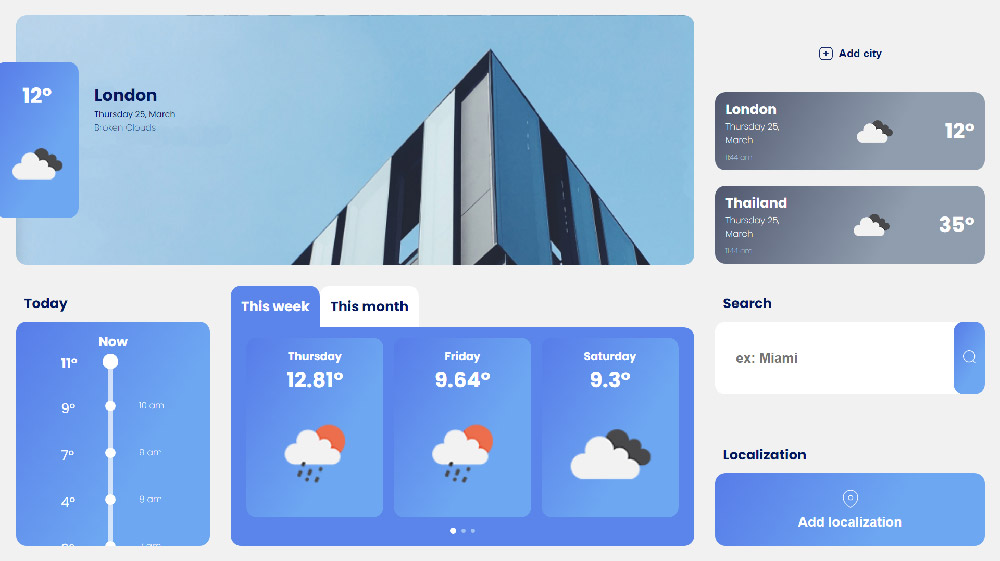

# Weather PWA

---

## Description

It's a web app that permits viewing the weather of different cities.
The service to retrieve the data is [Open Weather API](https://openweathermap.org/).

For each city, you can view the current weather of the city with the temperature, forecasts for this week, and the history of temperatures of the day.

You can save your favorite cities and view the current weather with just a click.

## Technologies

This PWA was made with:

-   **React** as the main framework (with hooks)
-   **Redux** as state manager (with hooks)
-   **Storybook** as documentation for components
-   **Cypress** as E2E testing library
-   **Jest** as the unit testing library

## How to do to use it locally

-   Just clone this repository and launch on the project folder `npm install`
-   You must register in the open weather platform and retrieve your API KEY
-   When you have the API KEY just duplicate `.env.example` and rename it in `.env` and insert your API KEY inside this file
-   For starting the project you can launch `npm start`
-   For starting the unit tests you can launch `npm run test`
-   For starting the E2E tests you can launch `npm run cypress`
-   For showing the components documentation you can launch `npm run storybook`

## Decisions made during the test interview

-   I prefer to avoid storing the saved cities in local storage to focus better on the request. This decision would have taken greater effort for managing the state and updates the local storage when data becomes old.
-   I have implemented a responsive mobile view to show better the interface with minor resolutions. In the request is not specified what behavior would behave is expected
-   Unfortunately, I cannot take the exact font and sizes because I can't access the mockup details. For this reason, I tried to follow it as strictly as I can and I edit the icons personally to implement them.

---

This project was bootstrapped with [Create React App](https://github.com/facebook/create-react-app), using the [Redux](https://redux.js.org/) and [Redux Toolkit](https://redux-toolkit.js.org/) template.

## Available Scripts

In the project directory, you can run:

### `yarn start`

Runs the app in the development mode. 
Open [http://localhost:3000](http://localhost:3000) to view it in the browser.

The page will reload if you make edits. 
You will also see any lint errors in the console.

### `yarn test`

Launches the test runner in the interactive watch mode. 
See the section about [running tests](https://facebook.github.io/create-react-app/docs/running-tests) for more information.

### `yarn build`

Builds the app for production to the `build` folder. 
It correctly bundles React in production mode and optimizes the build for the best performance.

The build is minified and the filenames include the hashes. 
Your app is ready to be deployed!

See the section about [deployment](https://facebook.github.io/create-react-app/docs/deployment) for more information.

### `yarn eject`

**Note: this is a one-way operation. Once you `eject`, you can’t go back!**

If you aren’t satisfied with the build tool and configuration choices, you can `eject` at any time. This command will remove the single build dependency from your project.

Instead, it will copy all the configuration files and the transitive dependencies (Webpack, Babel, ESLint, etc) right into your project so you have full control over them. All of the commands except `eject` will still work, but they will point to the copied scripts so you can tweak them. At this point you’re on your own.

You don’t have to ever use `eject`. The curated feature set is suitable for small and middle deployments, and you shouldn’t feel obligated to use this feature. However we understand that this tool wouldn’t be useful if you couldn’t customize it when you are ready for it.

## Learn More

You can learn more in the [Create React App documentation](https://facebook.github.io/create-react-app/docs/getting-started).

To learn React, check out the [React documentation](https://reactjs.org/).

### Code Splitting

This section has moved here: https://facebook.github.io/create-react-app/docs/code-splitting

### Analyzing the Bundle Size

This section has moved here: https://facebook.github.io/create-react-app/docs/analyzing-the-bundle-size

### Making a Progressive Web App

This section has moved here: https://facebook.github.io/create-react-app/docs/making-a-progressive-web-app

### Advanced Configuration

This section has moved here: https://facebook.github.io/create-react-app/docs/advanced-configuration

### Deployment

This section has moved here: https://facebook.github.io/create-react-app/docs/deployment

### `yarn build` fails to minify

This section has moved here: https://facebook.github.io/create-react-app/docs/troubleshooting#npm-run-build-fails-to-minify
